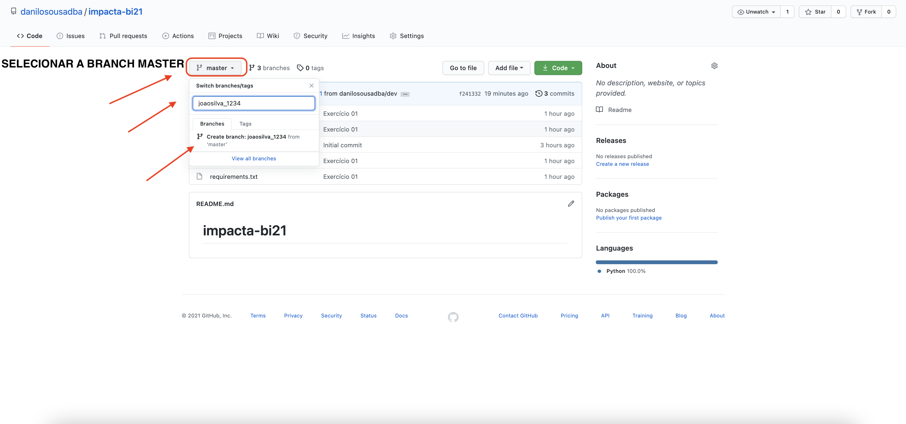
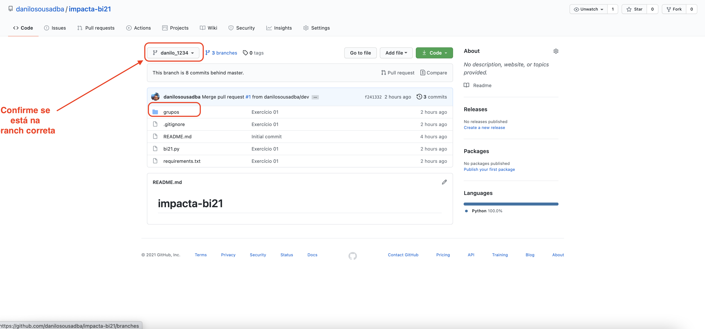
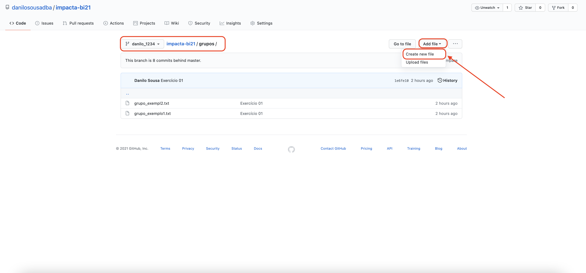
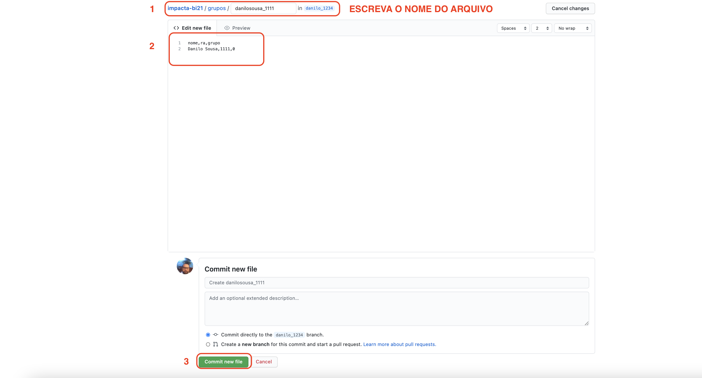
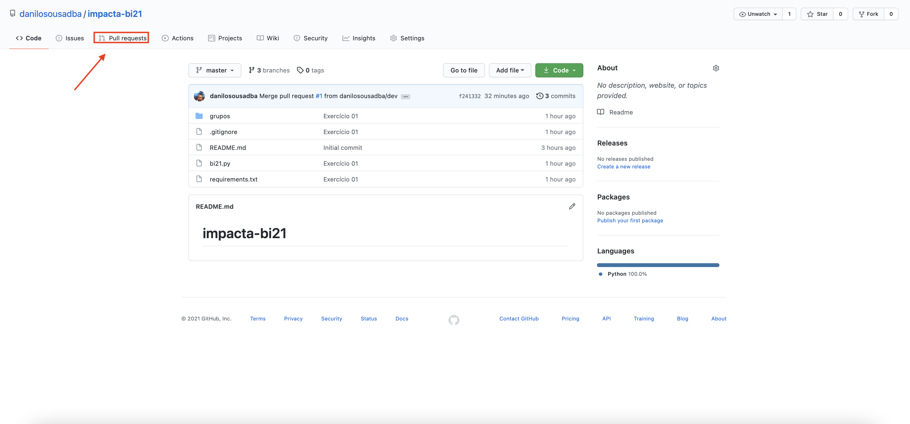
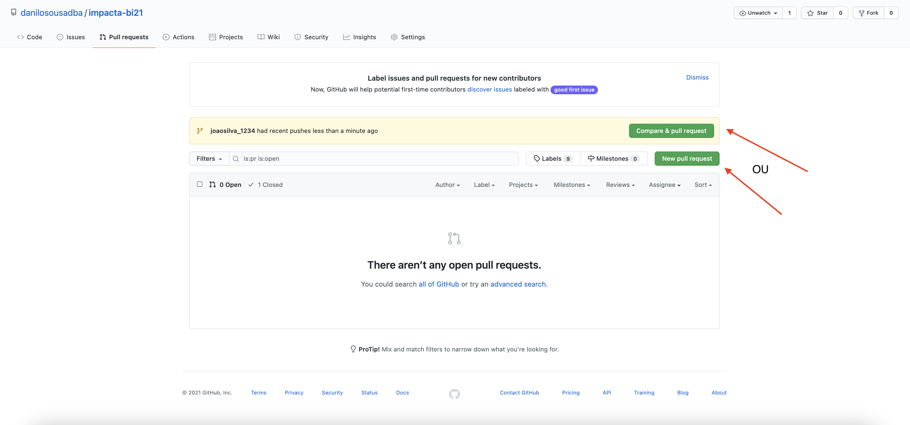
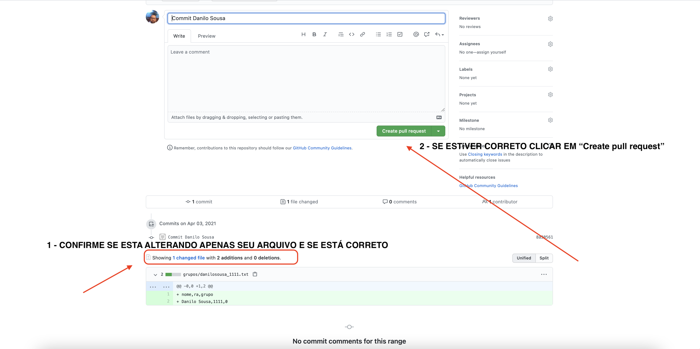

# impacta-bi22-23

## Exercício 01 - Individual

Objetivo do exercício é fazer com que a turma consiga trabalhar no mesmo repositório no GitHub.

Foi desenvolvido um script em Python [bi21.py](bi21.py) que irá gerar uma lista dos alunos para que recebam a nota e presença. Os arquivos deverão ser gravados no diretório [grupos](grupos) com o conteúdo "nome", "ra" e "grupo dos alunos.

<b>A nota e presença será dada SOMENTE se o aluno estiver na lista.</b>

Com base nesta lista os alunos receberão as notas e presenças.

* <b>Cada aluno deverá criar sua branch com o nome_ra.

    EX: joaosilva_1234,mariaduarte_4221,josepassos_12345 </b>
```
git clone https://github.com/danilosousadba/impacta-bi22-23.git
git checkout -b joaosilva_1234
```
<b>OU DIRETAMENTE PELO SITE</b>




* <b>Cada aluno deverá criar um arquivo contendo seu nome,ra e grupo com a extensão txt.</b>

  Ex. joaosilva_1234.txt, mariaduarte_4321.txt, josepassos_12345.txt" com as informações "nome","ra","grupo" conforme exemplo abaixo

joaosilva.txt
```
nome,ra,grupo
Joao Silva,1234,1
```

```
git status
```
<i>resultado</i>
```
On branch joaosilva_1234
Untracked files:
  (use "git add <file>..." to include in what will be committed)
        grupos/joaosilva_1234.txt
```


```
git add grupos/joaosilva_1234.txt
```

```
git commit -m "Commit Joao Silva"
```
```
git push origin joaosilva_1234
```
<b> OU FAZENDO DIRETAMENTE PELO GIT</b>








* <b>Agora o aluno deverá solicitar o pull request para a master.</b>





%
